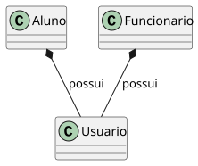

#+Title: Plantuml

#+name: usercomposition 
#+BEGIN_SRC plantuml :file user_composition.svg :exports both
@startuml
skinparam classAttributeIconSize 0

class Aluno {
}

class Funcionario {
}

class Usuario {
}

' Composition: The filled diamond is on the side of the "parent/owner"
' Aluno and Funcionario "possess" a Usuario.
Aluno *-- Usuario : possui
Funcionario *-- Usuario : possui

@enduml
#+END_SRC

#+RESULTS: usercomposition

