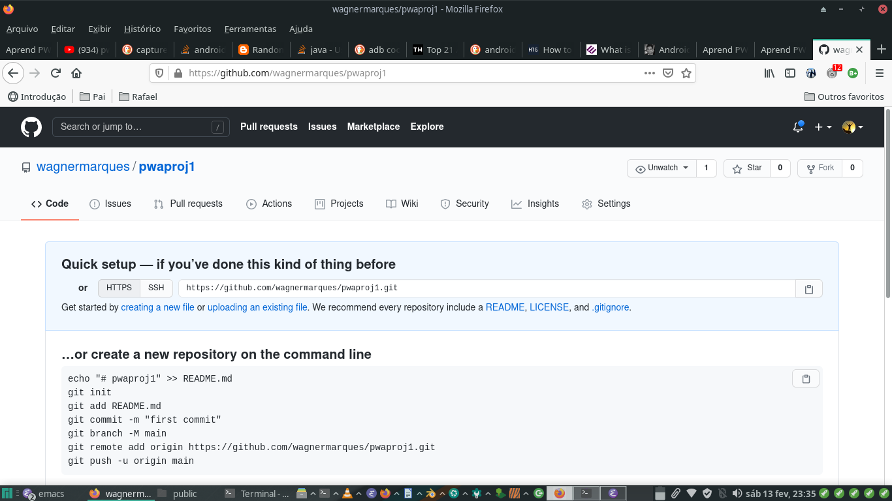
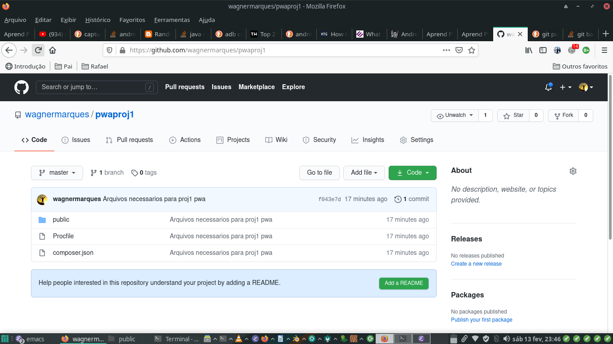

#+Title: Primeiro PWA
* Tema
  Primeiro PWA

* Justificativa e Objetivos
  Depois de conhecer os conceitos e a tecnologia pwa agora  gente
  precisa comecar a fazer um.

  A ideia a comecar com um pwa mais simples possivel

  O objetivo e por no ar na nuvem do heroku um html o mais basico
  possivel com um javascript que cria um service worker e um
  manifest.json.

* Duracao
  2 aulas

* Pre-Requisitos
** Conhecimentos Previos
   Visao geral da tecnologia pwa   ([[./pwa-apresentacao-da-tecnologia.org][Apresentacao da Tecnologia PWA]])
   
   Conhecimentos basicos sobre heroku

   Conhecimentos basicos de git e github

** Recursos
   conta no github

** Recomendacoes
   Leia de boa, sem ansiedade...
   Nao deixe de perguntar pro prof qdo tiver duvidas ok?
   Visite os links da referencia pra conhece-los, pelo menos

* Procedimento didatico
  exposicao dialogada pelo prof

  Atividade pratica

* Introducao
  Pessoal, nesta aula, vamos criar nosso primeiro pwa. A ideia e fazer
  da maneira mais simples possivel.

* Criando o projeto  

  Primeiro vamos criar um diretorio onde todos os *artefatos de
  software do nosso projeto* (todos os arquivos que compoe nosso projeto) vai ser criado.

** Criando uma pasta pro nosso projeto
  Eu vou chamar essa nova pasta que vamos criar de "projDir" tudo bem?

  Esse diretorio pode estar em qualquer lugar da sua maquina, mas nao
  use espaco ou caracteres especiais no caminho desse diretorio porque
  isso e pra usuario final rsrsr...

  Veja abaixo onde vai ficar minha pasta, a sua pode ser onde vc
  quizer desde que vc tenha permissao pra criar arquivos na pasta...

#+NAME:/home/wagner/fzlbpms/submodules/somewritings/pwa/projeto1
#+BEGIN_SRC shell :session s1 :results output :exports both
  export projDir=/run/media/wgn/libvirt_ext4/Projects-Srcs-Desktop/somewritings/pwa/projetopwa1
  mkdir -p $projDir
  
#+END_SRC

#+RESULTS: /home/wagner/fzlbpms/submodules/somewritings/pwa/projeto1

** Inicializando nosso diretorio como repositorio local
   Vcs sabem que pra trabalhar com heroku nosso diretorio tem que ser
   um repositorio do git ne? Por exemplo, pra gente enviar o nosso
   projeto pro heroku, por exemplo, temos que dar um git push...

   Entao e isso que vamos fazer agora, nosso projeto vai virar um
   repositorio local do git.
   
#+NAME:git init
#+BEGIN_SRC shell :session s1 :results output :exports both
cd $projDir
git init
#+END_SRC

#+RESULTS: git init
#+begin_example
hint: Using 'master' as the name for the initial branch. This default branch name
hint: is subject to change. To configure the initial branch name to use in all
hint: of your new repositories, which will suppress this warning, call:
hint:
hint: 	git config --global init.defaultBranch <name>
hint:
hint: Names commonly chosen instead of 'master' are 'main', 'trunk' and
hint: 'development'. The just-created branch can be renamed via this command:
hint:
hint: 	git branch -m <name>
hint:
hint: Disable this message with "git config set advice.defaultBranchName false"
Initialized empty Git repository in /run/media/wgn/libvirt_ext4/Projects-Srcs-Desktop/somewritings/pwa/projetopwa1/.git/
#+end_example

** Comecando o pwa
   E dentro do diretorio public que nosso pwa acontece, isso porque o
   pwa e so html e javascript...

   crie um html abrindo o vscode na pasta que acabamos de criar

   

*** crie o index.html
    
 crie o arquivo index.html com o conteudo abaixo e salve ele na pasta
 do projeto
 
#+NAME:index.html
#+BEGIN_SRC html :session s1 :results output :exports both
<!DOCTYPE html>
<html>

  <head>    
    <title>Aprend PWA</title>
    <link rel="manifest" href="/manifest.json?v=8">
    
  </head>

  <body>

    <h1>Aprend PWA (HOME)</h1>
    
    

      <a href="deviceorientation.html">Aprend PWA-Device
        Orientation</a>

    </img>
    
  </body>
</html> 

#+END_SRC

Fala serio.. nao poderia ser um html mais simples hein...

So tem dois detalhes com vc nao pode deixar passar desapercebido...

  + tab link para o arquivo manifest
    No head desse html temos um link do relacionamento do tipo
    "manifest"
    
    Nao sei se vc vai lembrar, mas esse manifest ja e um arquivo
    relativo a tecnologia pwa. A funcao dele foi falada na aula de
    aprensentacao do pwa, mas se vc esqueceu, tranquilo, pergunta pro
    prof...

    Claro que esse arquivo manifest.json tem que existir ne.. daqui a
    pouco vamos criar ele. Lembrando que o nome do arquivo ser
    manifest.json nao e obrigatorio. O que e obrigatorio para o pwa e
    que o link seja rel=manifest.

  + tag script que carrega nosso javascript
    Essa tag script so carrega nosso javascript.. nosso arquivo
    javascript chama main mas poderia ter qualquer outro nome... o
    nome nao e relevante pra pwa e sim o que o script faz.

    Neste caso, qdo vc for dar uma olhada nesse escript vc vai ver que
    ele vai registrar e ativar nosso serviceworker.

  + outra coisa que nosso html faz e carregar uma imagem a dog.svg
    Por causa disso nos vamos ter que prover essa imagem tambem na
    pasta public

** Criando o main.js, o manifest.json, dog.jpeg e cat.jpeg

   Vc vai criar esses arquivos e colocar eles todos no public, ok?

   Segue o conteudo o main.js
   
   Se vc ta seguindo aqui nosso passo a passo sem ansiedade vc vai ver
   com calma esse conteudo do main.js e seria muito muito da hora se
   vc percebesse o seguinte....

   O conteudo comeca com um if, depois tem um console... e depois tem
   uma a seguinte linha "navigator.serviceWorker.register('/service-worker-minimum-to-intall-pwa.js')"

   Percebeu que esse linha ta registrando um serviceworker e esse
   service worker e um outro arquivo javascript?

   Entao deixa essa "bola quicando" que a gente pega ela daqui a
   pouquinho pra criar esse arquivo...
   
#+NAME:main.js
#+BEGIN_SRC js :session s1 :results output :exports code
if ('serviceWorker' in navigator) {
    console.log("main.js => Vamos registrar o service worker!!!");
    navigator.serviceWorker.register('/service-worker-minimum-to-intall-pwa.js')
        .then(registration => {
            console.log("main.js => Service Worker Registrado com Sucesso");
            console.dir(registration);
        })
        .catch(error => {
            console.log("main.js => Erro ao registrar Service Worker");
            console.dir(error);
        });
}

#+END_SRC

Segue o conteudo o arquivo manifest.json

#+NAME:manifest.json
#+BEGIN_SRC js :session s1 :results output :exports code
  {
    "name": "AprendendoPWA",
    "short_name": "AprendPWA",
    "description": "WEB APP para aprender PWA (Disciplina PAMII).",
    "display": "fullscreen",
    "start_url":"index.html",    
    "scope": "/",
    
    "icons": [
        {
            "src": "app-icon-192x192.png",
            "sizes": "192x192",
            "type": "image/png"
        },
        {
            "src": "app-icon-512x512.png",
            "sizes": "512x512",
            "type": "image/png"
        }]
}

#+END_SRC

Agora crie tb as imagens... vc pode pega-las no proprio site que esta
online usando botao direito na imagem e dando um "salvar imagem
como"... https://aprendendopwa.herokuapp.com/

*Perceba que a imagem do cachorro e do gato esta no diretorio public os icones apontados no manifest esto no diretorio icon dentro do public.*

Abaixo segue toda a estrutura do nosso projeto...

#+NAME:tree estrutura do projeto
#+BEGIN_SRC shell :session s1 :results output :exports both
cd $projDir
tree
#+END_SRC

#+RESULTS: tree estrutura do projeto
#+begin_example
 .
 composer.json
 Procfile
 public
     cat.svg
     dog.svg
     icon
         app-icon-192x192.png
          app-icon-512x512.png
     index.html
     index.php
     js
        main.js
     manifest.json

3 directories, 10 files
#+end_example

** Criando o arquivo service-worker-minimum-to-intall-pwa
   Sabe aquela "bola quicando" esperando a gente criar o arquivo
   arquivo service-worker-minimum-to-intall-pwa.js?

   Esse arquive deve ter o seguinte conteudo...

   *Esse arquivo deve estar no diretorio public*.

#+NAME: arquivo service-worker-minimum-to-intall-pwa
#+BEGIN_SRC js :session s1 :results output :exports code
  self.addEventListener('install', event => {
    console.log('sw ./ => installing...');

    // cache a cat SVG
    event.waitUntil(
        caches.open('static-v1').then(cache => cache.add('/cat.svg'))
    );
    
    console.log("sw ./ =>  install event detected e cat.svg cacheado!!!");
    
});

self.addEventListener('activate', event => {
    console.log('sw ./ => Evento activate ocorreu, agora pronto pra interceptar fetches');
});

self.addEventListener('fetch', event => {
    console.log("sw ./ => Detectei um evento fetch para o recurso abaixo:");
    console.log("sw ./ => "+event.request.url);
    
    const url = new URL(event.request.url);
    
    // serve the cat SVG from the cache if the request is
    // same-origin and the path is '/dog.svg'
    if (url.origin == location.origin && url.pathname == '/dog.svg') {
        event. respondWith(caches.match('/cat.svg'));
    }
});

#+END_SRC

** Enviando tudo para o git e depois pro gitpages
   Bom, temos tudo que precisamos pro nosso projeto pwa inicial
   simplizao...

   Agora a gente quer enviar tudo pro gitpages certo?

#+NAME:git status22
#+BEGIN_SRC shell :session s1 :results output :exports both
cd $projDir
git status
#+END_SRC

#+RESULTS: git status22
#+begin_example
On branch master

No commits yet

Untracked files:
  (use "git add <file>..." to include in what will be committed)
	app-icon-192x192.png
	app-icon-512x512.png
	dog.jpeg
	gato.jpeg
	index.html
	main.js
	manifest.json
	service-worker-minimum-to-intall-pwa.js

nothing added to commit but untracked files present (use "git add" to track)
#+end_example

   
#+NAME:git add .
#+BEGIN_SRC shell :session s1 :results output :exports both
cd $projDir
git add .
#+END_SRC

#+RESULTS: git add .

#+NAME:git status
#+BEGIN_SRC shell :session s1 :results output :exports both
cd $projDir
git status
#+END_SRC

#+RESULTS: git status
#+begin_example
On branch master

No commits yet

Changes to be committed:
  (use "git rm --cached <file>..." to unstage)
	new file:   app-icon-192x192.png
	new file:   app-icon-512x512.png
	new file:   dog.jpeg
	new file:   gato.jpeg
	new file:   index.html
	new file:   main.js
	new file:   manifest.json
	new file:   service-worker-minimum-to-intall-pwa.js
#+end_example

#+NAME:git commit -am "Arquivos necessarios para proj1 pwa"
#+BEGIN_SRC shell :session s1 :results output :exports both
cd $projDir
git commit -am "Arquivos necessarios para proj1 pwa"
#+END_SRC

#+RESULTS: git commit -am "Arquivos necessarios para proj1 pwa"
#+begin_example
[master (root-commit) 064bb35] Arquivos necessarios para proj1 pwa
 8 files changed, 83 insertions(+)
 create mode 100644 app-icon-192x192.png
 create mode 100644 app-icon-512x512.png
 create mode 100644 dog.jpeg
 create mode 100644 gato.jpeg
 create mode 100644 index.html
 create mode 100644 main.js
 create mode 100644 manifest.json
 create mode 100644 service-worker-minimum-to-intall-pwa.js
#+end_example

** criando um repo no git e subindo

#+NAME:git git remote -v1
#+BEGIN_SRC shell :session s1 :results output :exports both
cd $projDir
git remote -v
#+END_SRC

#+RESULTS: git git remote -v1

#+NAME: git remote add origin https://github.com/wagnermarques/aulasdepwa.git1
#+BEGIN_SRC shell :session s1 :results output :exports both
cd $projDir
git remote add origin https://github.com/wagnermarques/aulasdepwa.git
#+END_SRC

#+RESULTS: git remote add origin https://github.com/wagnermarques/aulasdepwa.git1

#+NAME:git git remote -v2
#+BEGIN_SRC shell :session s1 :results output :exports both
cd $projDir
git remote -v
#+END_SRC

#+NAME:git branch11
#+BEGIN_SRC shell :session s1 :results output :exports both
cd $projDir
git branch
#+END_SRC

considerando que retornou branch master.. vamos continuar.. se na sua
for main só trocar master por main

[wgn@fedora projetopwa1]$ git push origin master
fatal: cannot exec '/usr/bin/ksshaskpass': Arquivo ou diretório inexistente
Username for 'https://github.com': wagnermarques
fatal: cannot exec '/usr/bin/ksshaskpass': Arquivo ou diretório inexistente
Password for 'https://wagnermarques@github.com': sua personal access token

Enumerating objects: 10, done.
Counting objects: 100% (10/10), done.
Delta compression using up to 28 threads
Compressing objects: 100% (10/10), done.
Writing objects: 100% (10/10), 191.43 KiB | 63.81 MiB/s, done.
Total 10 (delta 0), reused 0 (delta 0), pack-reused 0 (from 0)
To https://github.com/wagnermarques/aulasdepwa.git
 * [new branch]      master -> master
[wgn@fedora projetopwa1]$ 

* mandando pro github pages

* Exercicioos e Atividades de Reflexao/Fixacao
  link do seu projeto no github
  
  Bom, pra enviar o link do seu projeto no github vc precisar fazer
  push pra la, certo?

  Pra isso vc tem que ter um repositorio criado no github pra isso,
  certo?

  Entao criar um repositorio entao, eu vou chamar o meu de pwaproj1 e
  vou dar push pra ele mas vc pode dar outro nome se quizer...

 
  Com o repositorio pwaproj1 criado eu preciso pegar a url dele...

  Veja abaixo como ficou minha criacao do repositorio no github...

  

  Agora sim temos um lugar no github pra dar push nos nossos
  arquivos...

  So que nosso repositorio local ainda nao sabe que criamos esse
  repositorio remoto? A gente tem que avisar nosso repositorio local
  de que tambem podemos dar push nele pro github...

  vamos fazer isso fazenso do seguinte... copiando a url do
  repositorio do github adicionando essa url como um repositorio
  remoto no nosso repositorio local... confundiu um pouco ne? mas e so
  dar esses comando abaixo que da certo...

  
#+NAME:git add remote https://github.com/wagnermarques/pwaproj1.git
#+BEGIN_SRC shell :session s1 :results output :exports both
cd $projDir
git remote add origin https://github.com/wagnermarques/pwaproj1.git
#+END_SRC

#+RESULTS: git add remote https://github.com/wagnermarques/pwaproj1.git

pode ver abaixo que agora temos esse repositorio remoto tambem pra
poder dar push, no caso do github

#+NAME:git remote -v
#+BEGIN_SRC shell :session s1 :results output :exports both
cd $projDir
git remote -v
#+END_SRC

#+RESULTS: git remote -v
: 
: heroku	https://git.heroku.com/pwaproj1.git (fetch)
: heroku	https://git.heroku.com/pwaproj1.git (push)
: origin	https://github.com/wagnermarques/pwaproj1.git (fetch)
: origin	https://github.com/wagnermarques/pwaproj1.git (push)

Agora sim, vc pode dar push pro github

#+NAME:git push
#+BEGIN_SRC shell :session s1 :results output :exports both
cd $projDir
git push origin master
#+END_SRC

Abaixo esta o print dos arquivos do projeto upados pro github...

Lembrando que este repositorio foi criado apenas para essa aula
especifica e eu vou apagar ele assim que eu terminar esse
material. Entao esse vcs nao vao encontrar esse repositorio la, caso
queiram visualizar os arquivos do projeto, tem um repositorio que eu
nao apago que e o aprendendopwa.

Ate mais pessoal, bons estudos..

* Avaliacao
  + Cumprimento de prazo
  + Completeza do trabalh
  + Cumunicacao com prof e com os colegas
  + Colaboracao com demais colegas
  
* Referencias

